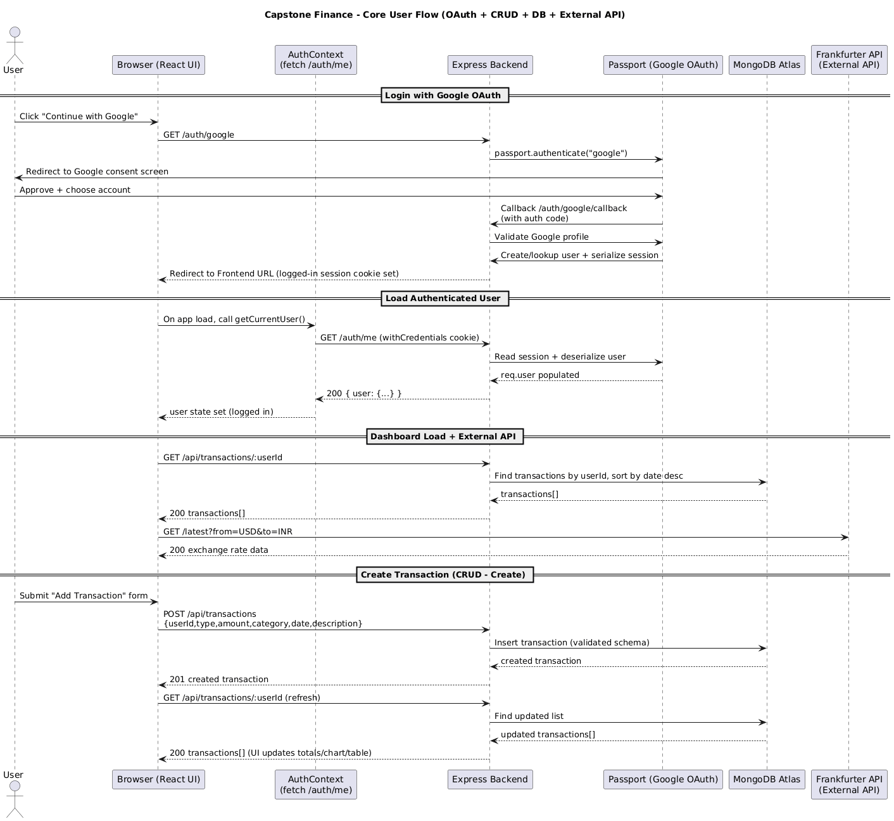

# Capstone Finance – Personal Expense Dashboard

Capstone Finance is a full-stack personal finance web application that allows users to securely authenticate using Google OAuth and manage their income and expenses. The application demonstrates full CRUD functionality, database integration, external API usage, modern React features, and professional deployment.

This project was built to satisfy all requirements of the Capstone Project Rubric.

---

## 🔗 Live Deployment Links

- **Frontend (Render – Static Site):**  
  https://capstone-frontend-yqjn.onrender.com

- **Backend (Render – Web Service):**  
  https://capstone-backend-c557.onrender.com

---

## 📌 Project Overview

Capstone Finance enables users to:
- Sign in securely using Google OAuth
- Create, view, update, and delete financial transactions
- Track income, expenses, and net balance
- Visualize expenses by category
- Interact with an external currency exchange API
- Persist data securely in MongoDB Atlas

All features are available only to authenticated users.

---

## 🔐 Authentication & Authorization

- Implemented **Google OAuth 2.0** using `passport-google-oauth20`
- Session-based authentication using `express-session`
- Secure cookies configured with:
  - `Secure: true`
  - `SameSite: none`
- Auth state managed on the frontend using React Context
- Protected routes ensure unauthenticated users cannot access the dashboard

This satisfies the **Login / Authentication** rubric requirement.

---

## 🧾 CRUD Functionality (Express + MongoDB)

The backend provides full CRUD functionality for transactions:

### ➕ Create
Users can add a new transaction with:
- Type (income or expense)
- Amount
- Category
- Date
- Optional description

### 📖 Read
- Users can view all transactions associated with their account
- Data is fetched from MongoDB Atlas and sorted by date

### ✏️ Update
- Existing transactions can be edited
- Updates persist in the database immediately

### 🗑️ Delete
- Transactions can be permanently deleted
- UI updates in real time after deletion

All CRUD routes are implemented using Express and Mongoose and are fully integrated with the frontend.

This satisfies the **CRUD Functionality** rubric requirement.

---

## 🗄️ Database Integration

- MongoDB Atlas cloud database
- Mongoose ODM used for schema modeling and validation
- Secure connection using environment variables
- User-specific transaction isolation
- Persistent data across sessions and page reloads

This satisfies the **Database Integration** rubric requirement.

---

## ⚛️ Frontend – React Features

The frontend is built using **React + Vite** and includes:

### Advanced React Features
- `useContext` for authentication state
- `useReducer` for filter state management
- `useSWR` for efficient data fetching and caching
- Conditional rendering based on authentication state

### Interactivity & Personalization
- Dynamic dashboard updates
- User-specific data display
- Filters by transaction type and category
- Real-time UI updates after CRUD actions

This satisfies the **Advanced React Features** and **Interactivity & Personalization** rubric categories.

---

## 📊 Data Visualization

- Uses **Recharts** library
- Pie chart visualizing expenses by category
- Responsive and interactive charts
- Graceful handling when no data is available

This satisfies the **Additional Library Usage** requirement.

---

## 🌍 External API Integration

- Integrates the **Frankfurter Currency Exchange API**
- Displays live USD → INR conversion rate
- Demonstrates external API usage with error handling
- Clearly labeled data source in the UI

This satisfies the **External API Usage** rubric requirement.

---

## 🎨 UI / UX & Accessibility

- Clean, professional dashboard layout
- Responsive design for different screen sizes
- Consistent color palette and typography
- Accessible contrast and readable text
- Clear visual hierarchy and spacing

This satisfies the **Deployment & Accessibility** rubric requirement.

---

## 🚀 Deployment

### Frontend
- Deployed on **Render** as a static site
- Built using Vite
- Uses environment variables for backend API URL

### Backend
- Deployed on **Render** as a web service
- Handles OAuth, sessions, API routes, and database access
- Automatically restarts on deployment

This satisfies the **Backend Deployment** rubric requirement.

---

## 🧱 Tech Stack

### Frontend
- React
- Vite
- Axios
- SWR
- Recharts
- CSS (custom styling)

### Backend
- Node.js
- Express
- MongoDB Atlas
- Mongoose
- Passport.js
- Google OAuth 2.0

### Deployment
- Render (Frontend & Backend)
- MongoDB Atlas (Database)

---

## 📂 Project Structure

frontend/
├── src/
│ ├── pages/
│ │ ├── Dashboard.jsx
│ │ └── Home.jsx
│ ├── context/
│ │ └── AuthContext.jsx
│ ├── api/
│ │ └── axios.js
│ └── index.css

backend/
├── src/
│ ├── models/
│ │ └── Transaction.js
│ ├── routes/
│ │ ├── auth.js
│ │ └── transactions.js
│ ├── config/
│ │ └── passport.js
│ └── server.js

---

## Sequence Diagram

The following sequence diagram illustrates the complete system flow for the Capstone Finance application, including:

- Google OAuth authentication
- Session handling with Passport.js
- Dashboard data loading
- CRUD operations for transactions
- External API integration (Frankfurter currency API)

## 🎥 Video Demonstration

The video demonstration includes:
- Live deployment overview
- Google OAuth login flow
- Full CRUD functionality demonstration
- React interactivity and filtering
- External API usage
- Database persistence validation

---

## 🏁 Conclusion

Capstone Finance is a complete, production-ready full-stack application that demonstrates authentication, CRUD functionality, database integration, external APIs, modern React practices, and professional deployment. The project satisfies all rubric requirements and showcases practical full-stack development skills.

